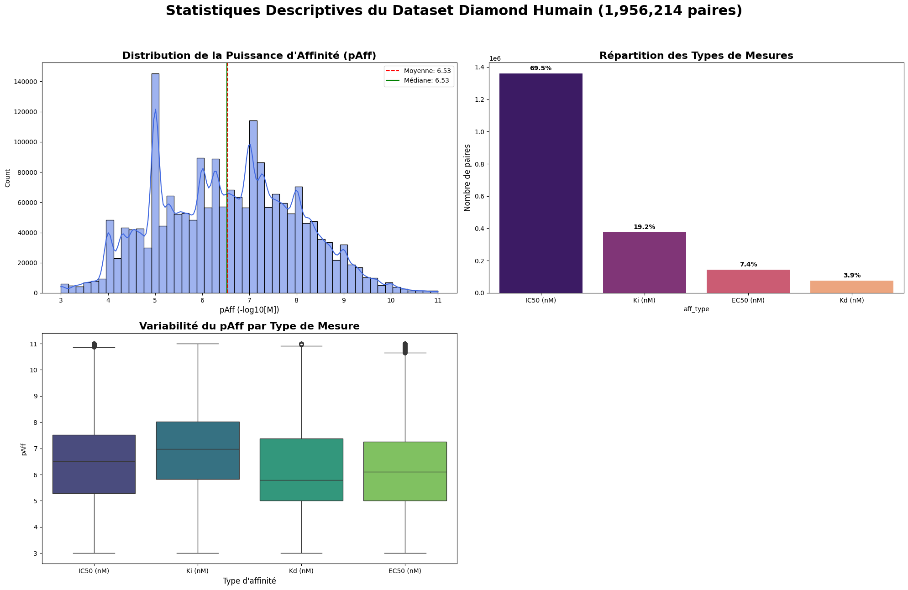
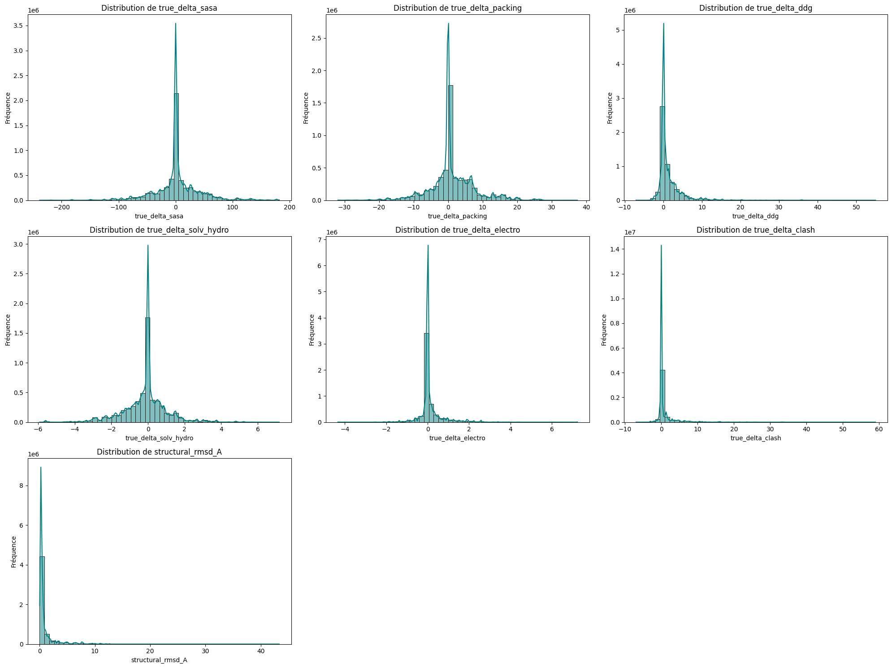
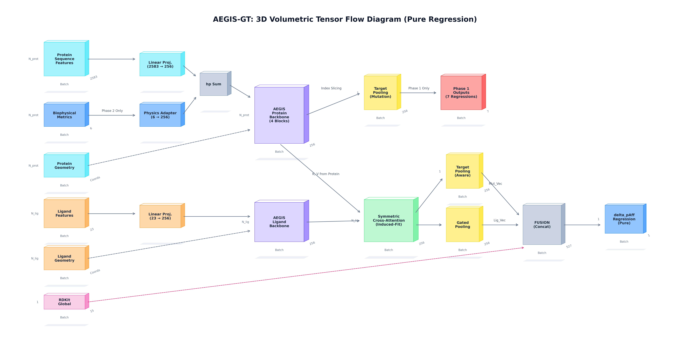
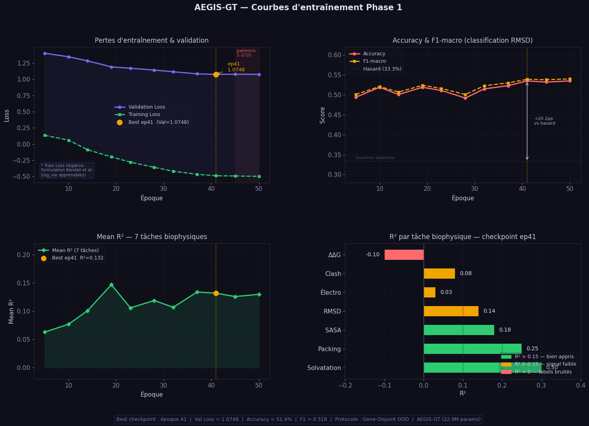
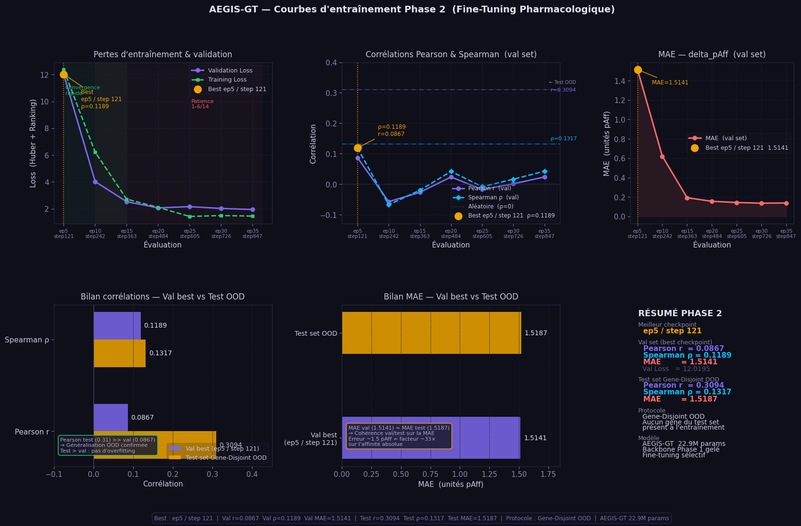

# AEGIS-GT — Geometric Transformer for Oncogenic Variant Screening

**AEGIS-GT** (*Affinity Evaluation & Geometric Induced-fit Screening — Geometric Transformer*) is a research pipeline that predicts how cancer-driving point mutations reshape a protein's 3D structure and alter its binding affinity to small-molecule ligands. It combines protein language models, structure prediction, physics-based structural refinement, and a heterogeneous geometric graph neural network trained in two stages.

Developed as part of the [SmartADN](https://smartadn.com) research initiative.

---

## Pipeline Overview

| Stage | Tool / Model | Purpose |
|---|---|---|
| Sequence embeddings | **ESM-2** | Per-residue evolutionary embeddings for wild-type and mutated protein sequences |
| Backbone structure prediction | **ESMFold** | 3D backbone coordinates generated directly from the mutated sequence |
| Side-chain refinement | **FoldX 5.1** | Physics-based side-chain repacking and structural energetics (ΔΔG, clashes, electrostatics, SASA, packing) around the mutated site |
| Ligand 3D generation | **RDKit** | Conformer generation and geometric/physicochemical featurization of candidate ligands from SMILES |
| Affinity / structure model | **AEGIS-GT (HeteroGNN)** | A heterogeneous geometric graph transformer that jointly encodes the protein residue graph and the ligand atom graph, with cross-attention between the two, to predict structural perturbation and binding affinity shift |

### 1. Data curation
Oncogenic missense variants are aggregated from **COSMIC** (confirmed pathogenic mutations) and **ClinVar** (pathogenic / likely pathogenic classifications), then merged with experimentally measured protein–ligand affinities (IC50, Ki, Kd, EC50) from **BindingDB**.


*Descriptive statistics of the curated BindingDB affinity dataset (~1.96M protein–ligand pairs) used for pharmacological fine-tuning.*

### 2. 3D structure generation
For every wild-type/mutant pair, `ESMFold` predicts the backbone, and `FoldX 5.1` repacks side chains around the mutation to produce physically consistent structures. Seven biophysical descriptors are derived from the wild-type → mutant structural delta and used as pretraining targets:


*Distribution of the seven structural biophysical targets (ΔSASA, ΔPacking, ΔΔG, ΔSolvation, ΔElectrostatics, ΔClash, structural RMSD) used to pretrain the model.*

### 3. Model architecture — AEGIS-GT
AEGIS-GT is a **heterogeneous geometric graph transformer (HeteroGNN)**: the protein graph (residues, built via radius/kNN graphs over 3D coordinates with `torch_cluster`) and the ligand graph (atoms, from RDKit conformers) are each encoded by dedicated backbones, then fused through symmetric cross-attention (an induced-fit mechanism) before pooling into structural and affinity predictions. The model totals **22.9M parameters**.


*AEGIS-GT tensor flow: separate protein/ligand backbones, physics-aware feature adapters, cross-attention fusion, and dual regression heads (structural deltas in Phase 1, binding affinity in Phase 2).*

### 4. Two-stage training

**Phase 1 — Structural pretraining.** The model learns to predict the seven biophysical deltas (ΔΔG, clash, electrostatics, RMSD, SASA, packing, solvation) from the mutated protein structure alone, under a strict **Gene-Disjoint Out-Of-Distribution (OOD)** split (no gene present in training appears in the held-out evaluation set).


*Phase 1 training/validation loss and per-task R² under the Gene-Disjoint OOD protocol.*

**Phase 2 — Pharmacological fine-tuning.** The pretrained protein backbone is frozen (selective fine-tuning) while the model is trained on the BindingDB affinity data to predict `delta_pAff` (affinity shift induced by the mutation), using a combined Huber + pairwise ranking loss, again under the Gene-Disjoint OOD protocol.


*Phase 2 fine-tuning curves — loss, Pearson/Spearman correlation and MAE, with the final validation vs. Gene-Disjoint OOD test comparison.*

---

## Final Results — Gene-Disjoint OOD Test Set

Evaluated on the held-out test set, restored from the best checkpoint (`ep5 / step121`), where **no gene from the training set appears in the test set**:

| Metric | Value |
|---|---|
| Val Loss | **6.4409** |
| Pearson r | **0.3094** |
| Spearman ρ | **0.1317** |
| MAE | **1.5187** |

The Pearson correlation on the OOD test set (0.3094) exceeding the validation-set correlation (0.0867) confirms the model generalizes to previously unseen genes rather than overfitting to the training distribution.

---

## Repository Structure

```
aegis-gt-research/
├── criblage-virtuel-firstpart.ipynb              # Data curation: BindingDB, COSMIC, ClinVar processing
├── criblage-virtuel-final-version-phase1.ipynb   # ESM-2/ESMFold/FoldX featurization + Phase 1 structural pretraining
├── criblage-virtuel-final-version-phase2.ipynb   # Phase 2 pharmacological fine-tuning
├── images/                                       # Figures extracted from the notebooks
├── .gitignore
└── README.md
```

## Requirements

The notebooks were developed and run on Kaggle (GPU) and rely on:

- `torch`, `torch-geometric`, `torch-scatter`, `torch-cluster`
- `rdkit`, `biopython`, `freesasa`, `py3Dmol`
- `pandas`, `numpy`, `polars`, `pyarrow`
- `statsmodels`, `graphviz`

FoldX 5.1 is a separate third-party binary (academic license required) and is not redistributed in this repository.

---

## About

Part of the [SmartADN](https://smartadn.com) research initiative on computational oncology and virtual screening.
