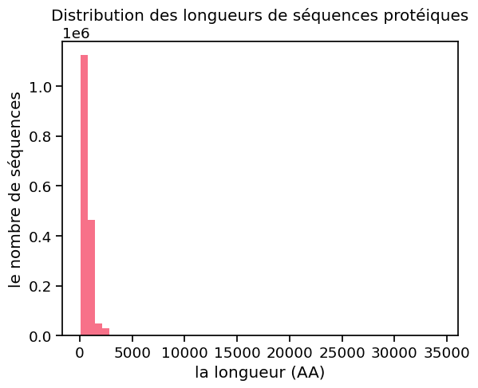
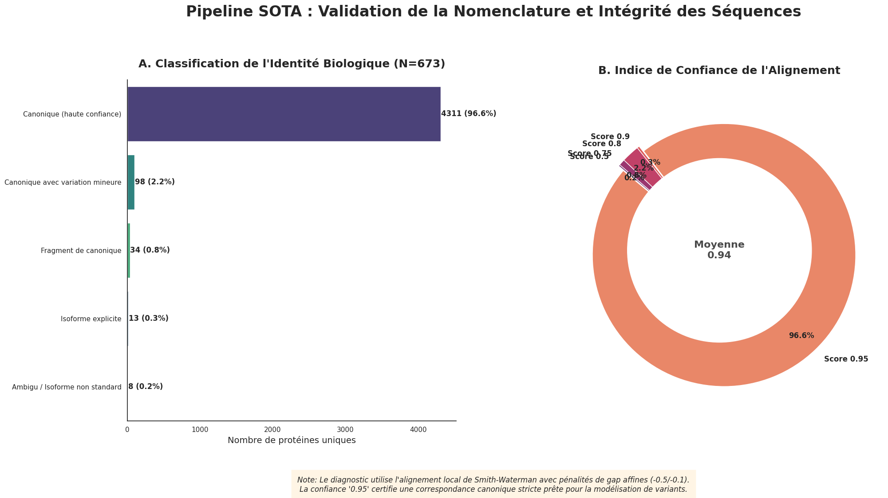
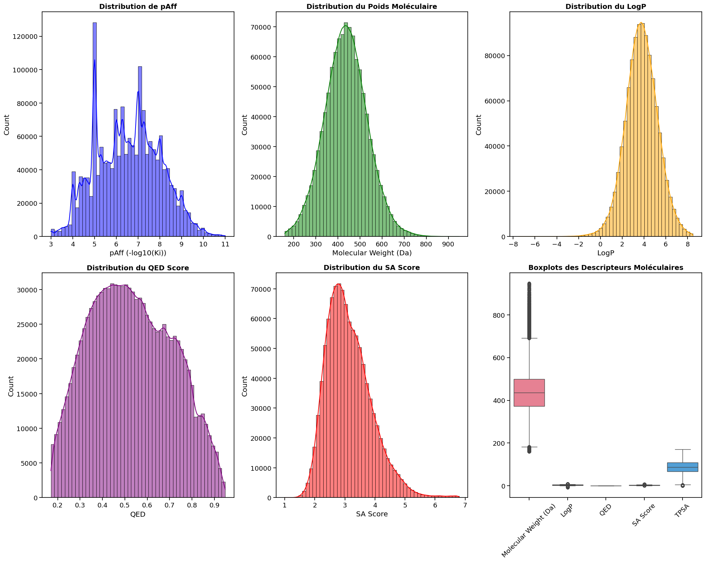
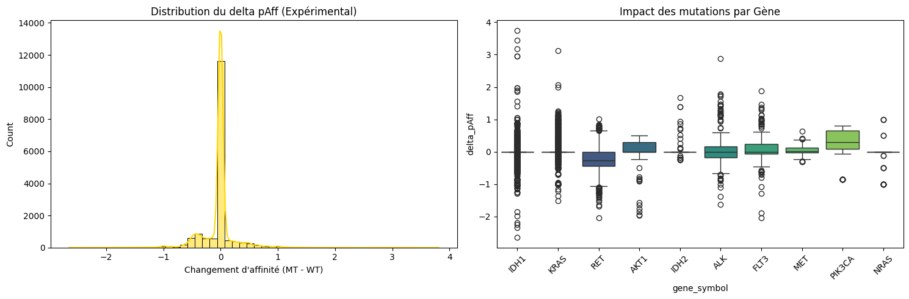
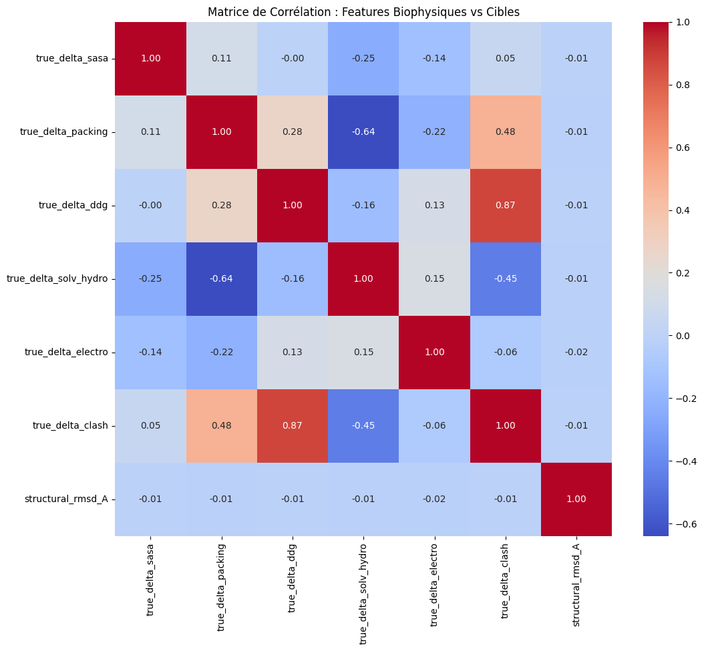
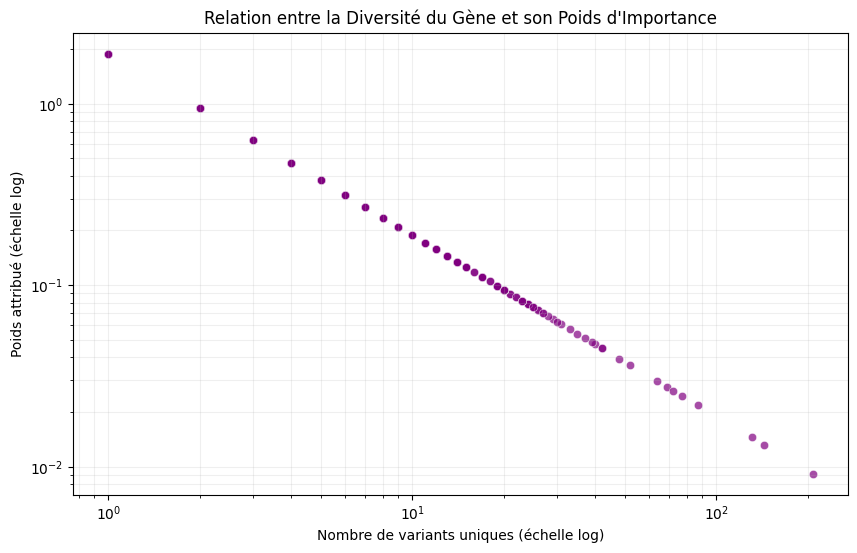
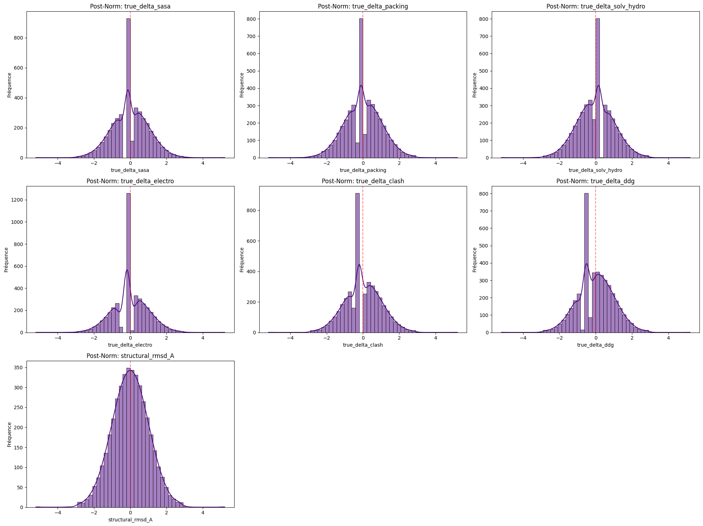
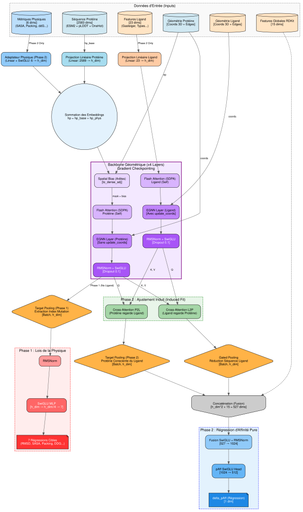
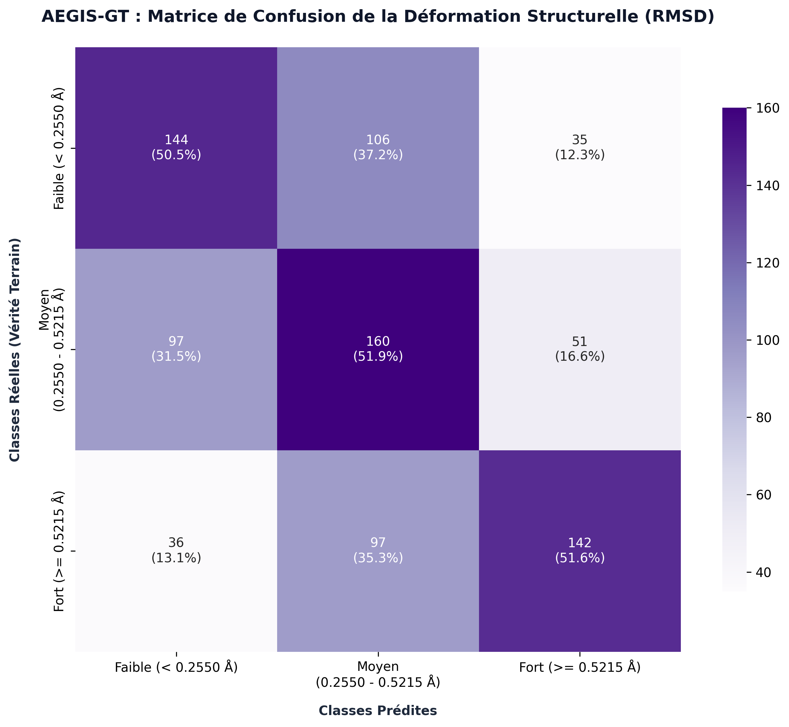
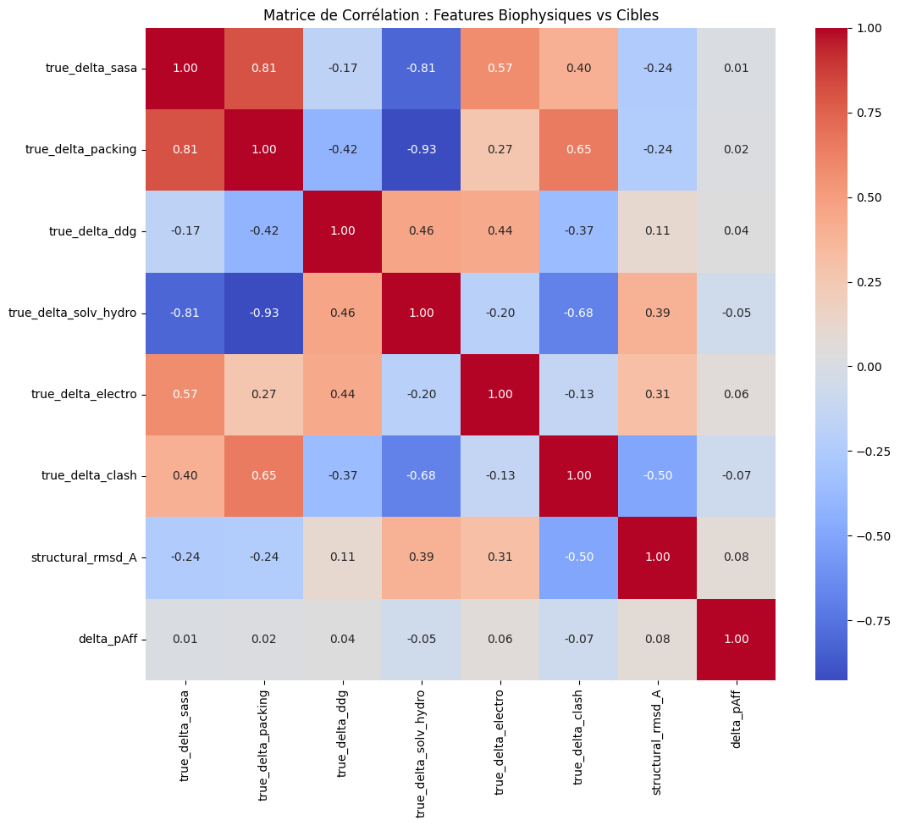

# AEGIS-GT — Geometric Transformer for Oncogenic Variant Screening

**AEGIS-GT** (*Affinity Evaluation & Geometric Induced-fit Screening — Geometric Transformer*) is a research pipeline that predicts how cancer-driving point mutations reshape a protein's 3D structure and alter its binding affinity to small-molecule ligands. It combines protein language models, structure prediction, physics-based structural refinement, and a heterogeneous geometric graph neural network trained in two stages.

Developed as part of the [SmartADN](https://smartadn.com) research initiative.

This document walks through the full methodology exactly as implemented across the three notebooks, and reports results as measured — including where the model underperforms.

---

## Pipeline Overview

| Stage | Tool / Model | Purpose |
|---|---|---|
| Sequence embeddings | **ESM-2** | Per-residue evolutionary embeddings for wild-type and mutated protein sequences |
| Backbone structure prediction | **ESMFold** | 3D backbone coordinates generated directly from the mutated sequence |
| Side-chain refinement | **FoldX 5.1** | Physics-based side-chain repacking and structural energetics (ΔΔG, clashes, electrostatics, SASA, packing) around the mutated site |
| Ligand 3D generation | **RDKit** | Conformer generation and geometric/physicochemical featurization of candidate ligands from SMILES |
| Affinity / structure model | **AEGIS-GT (HeteroGNN)** | A heterogeneous geometric graph transformer that jointly encodes the protein residue graph and the ligand atom graph, with cross-attention between the two, to predict structural perturbation and binding affinity shift |

---

## 1. Data Curation (`criblage-virtuel-firstpart.ipynb`)

Oncogenic missense variants are aggregated from **COSMIC** (confirmed pathogenic mutations, Genome Screens Census) and **ClinVar** (pathogenic / likely pathogenic classifications), then cross-referenced against canonical UniProt sequences and merged with experimentally measured protein–ligand affinities (IC50, Ki, Kd, EC50) from **BindingDB**.


*Length distribution of the ~1.7M curated protein sequences pulled from COSMIC/ClinVar before filtering to model-compatible lengths.*


*Quality control pass on gene nomenclature and sequence integrity: each variant sequence is Smith-Waterman-aligned against its canonical UniProt reference. 96.6% of the 673 unique proteins matched canonically with a mean alignment confidence of 0.94, giving confidence that mutation coordinates map onto the correct reference frame before any structure prediction is attempted.*


*Descriptive statistics of the curated BindingDB affinity dataset ("Diamond", ~1.96M protein–ligand pairs): distribution of pAff, and the mix of measurement types (69.5% IC50, 19.2% Ki, 7.4% EC50, 3.9% Kd) later merged into a single confidence-weighted affinity scale.*


*RDKit-derived molecular descriptors (molecular weight, LogP, QED, synthetic accessibility) across the candidate ligand pool, used as sanity checks on drug-likeness before 3D conformer generation.*

---

## 2. Structure Generation & Featurization (`...phase1.ipynb`, early cells)

For every wild-type/mutant pair, `ESMFold` predicts the backbone from the mutated sequence, and `FoldX 5.1` repacks side chains around the mutation site to produce physically consistent structures. From the wild-type → mutant structural delta, **seven biophysical descriptors** are derived and used as the Phase 1 pretraining targets: ΔSASA, ΔPacking, ΔΔG, ΔSolvation (hydrophobic), ΔElectrostatics, ΔClash, and structural RMSD.


*The actual pharmacological target (`delta_pAff`, MT − WT affinity), broken down by driver gene (KRAS, IDH1, ALK, FLT3, PIK3CA...). This is the ground truth the model is ultimately trying to predict in Phase 2 — note the heavy tail and the very different mutation-impact spread from one gene to another.*


*Raw (pre-normalization) distribution of the seven FoldX-derived structural targets, computed over millions of mutation records. All are strongly zero-centered — most point mutations perturb structure only mildly, with a long tail of destabilizing outliers.*


*Correlation matrix between the seven Phase 1 targets. ΔΔG and Δclash are strongly correlated (r=0.87), as expected — steric clashes are a major contributor to destabilization — while ΔSASA and structural RMSD are essentially uncorrelated with everything else, meaning they carry independent signal.*


*Inverse-frequency sample weighting applied per gene during training: genes with hundreds of curated variants (e.g. TP53-like hubs) are down-weighted, rare genes with a single variant are up-weighted, to prevent the model from simply memorizing the handful of over-represented genes.*


*The same seven targets after z-score normalization on a held-out subsample — used as a sanity check that the normalization is correctly centering/scaling the targets before they hit the loss function.*

---

## 3. Model Architecture — AEGIS-GT

AEGIS-GT is a **heterogeneous geometric graph transformer (HeteroGNN)**, **22.9M parameters**. The protein graph (residues, edges built via radius/kNN graphs over 3D coordinates with `torch_cluster`) and the ligand graph (atoms, from RDKit conformers) are each encoded by a dedicated backbone (EGNN layers + spatial-bias self-attention + RMSNorm/SwiGLU), then fused through **symmetric cross-attention** — protein queries attending to ligand keys/values and vice-versa — modeling induced-fit binding rather than treating the two molecules independently. Gated attention pooling reduces the ligand sequence, and target-aware pooling extracts the mutated residue's representation on the protein side.


*Full computational graph: separate protein/ligand EGNN backbones, Flash Attention (SDPA) with a spatial distance bias, symmetric cross-attention (Cross_L2P / Cross_P2L), gated pooling, and the two task-specific heads — 7-way biophysical regression (Phase 1) and a 527→1024→512→1 fusion MLP for `delta_pAff` (Phase 2).*


*Simplified tensor-flow view of the same architecture: protein/ligand feature and geometry inputs, the physics-feature adapter (Phase 2 only), symmetric cross-attention as the induced-fit mechanism, and the fused 527-dim vector feeding the final regression head.*

---

## 4. Phase 1 — Structural Pretraining

The model learns to predict the seven biophysical deltas from the mutated protein structure alone, under a strict **Gene-Disjoint Out-Of-Distribution (OOD)** split — no gene present in training appears in the held-out evaluation set, which is what makes the reported metrics a genuine test of generalization rather than memorization.


*Training/validation loss, RMSD-classification accuracy vs. a random baseline (+20.2pp), mean R² across the 7 tasks, and per-task R² at the best checkpoint (epoch 41). Packing (R²=0.25) and solvation (R²=0.30) are learned reasonably well; **ΔΔG is not (R²=−0.10)** — worse than predicting the mean, despite being the most physically central of the seven targets. This is a genuine limitation of Phase 1, not a display artifact: ΔΔG values are extremely sparse and noisy at the FoldX-repacking scale used here, and the model's other five targets don't fully compensate for that.*


*Confusion matrix for the auxiliary 3-class RMSD-deformation classification task (Low / Medium / High structural change). ~51% overall accuracy against a 33.3% random baseline — a real but modest signal, consistent with the R² values above.*

---

## 5. Phase 2 — Pharmacological Fine-Tuning

The pretrained protein backbone is **frozen** (selective fine-tuning) while the model is trained on the BindingDB affinity subset to predict `delta_pAff`, using a combined Huber + pairwise ranking loss, again under the Gene-Disjoint OOD protocol.


*Correlation matrix recomputed on the (much smaller, ligand-matched) Phase 2 subset — note the structure is markedly different from the Phase 1 matrix above (e.g. ΔSASA vs. ΔPacking: 0.81 vs. 0.11), because this population is restricted to variants with a measured ligand affinity, i.e. known drug-binding pockets, not the full COSMIC/ClinVar diversity. `delta_pAff` itself is only weakly correlated with any single biophysical descriptor (∣r∣ ≤ 0.08), which is why the model needs the full learned representation rather than a simple linear combination of physics features.*


*Fine-tuning loss, Pearson/Spearman correlation and MAE over training, plus the final validation-set vs. Gene-Disjoint-OOD-test-set comparison at the best checkpoint (epoch 5 / step 121).*

---

## Final Results — Gene-Disjoint OOD Test Set

Evaluated on the held-out test set, restored from the best checkpoint (`ep5 / step121`), where **no gene from the training set appears in the test set**:

| Metric | Value |
|---|---|
| Val Loss | **6.4409** |
| Pearson r | **0.3094** |
| Spearman ρ | **0.1317** |
| MAE | **1.5187** |

The Pearson correlation on the OOD test set (0.3094) exceeding the validation-set correlation (0.0867) is a useful sanity check: it rules out gross overfitting to the training genes, and suggests the fine-tuned representation transfers to unseen genes rather than degrading on them.

## Honest Assessment

This is a research prototype, not a validated screening tool, and the numbers above should be read as such:

- **The affinity signal is real but weak.** Pearson r=0.31 on OOD is meaningfully above chance, but far from the correlation needed to rank candidate compounds with confidence in a real screening decision.
- **ΔΔG pretraining did not work** (R²=−0.10). Of the seven Phase 1 targets, this is the one most directly tied to binding thermodynamics, so its failure likely caps what Phase 2 can build on.
- **Label noise is baked into the pipeline at two levels**: FoldX-repacked structures (not experimental structures) generate the Phase 1 targets, and BindingDB affinities mix four different measurement types (IC50/Ki/Kd/EC50) merged via a heuristic confidence weighting — both are known, accepted sources of noise rather than oversights.
- **What *is* methodologically solid**: the Gene-Disjoint OOD protocol on both phases, the inverse-frequency gene weighting to avoid hub-gene memorization, and the sequence-nomenclature QC pass before any structure is even generated.

---

## Repository Structure

```
aegis-gt-research/
├── criblage-virtuel-firstpart.ipynb              # Data curation: BindingDB, COSMIC, ClinVar processing
├── criblage-virtuel-final-version-phase1.ipynb   # ESM-2/ESMFold/FoldX featurization + Phase 1 structural pretraining
├── criblage-virtuel-final-version-phase2.ipynb   # Phase 2 pharmacological fine-tuning
├── images/                                       # Figures extracted from the notebooks
├── .gitignore
└── README.md
```

## Requirements

The notebooks were developed and run on Kaggle (GPU) and rely on:

- `torch`, `torch-geometric`, `torch-scatter`, `torch-cluster`
- `rdkit`, `biopython`, `freesasa`, `py3Dmol`
- `pandas`, `numpy`, `polars`, `pyarrow`
- `statsmodels`, `graphviz`

FoldX 5.1 is a separate third-party binary (academic license required) and is not redistributed in this repository.

---

## About

Part of the [SmartADN](https://smartadn.com) research initiative on computational oncology and virtual screening.
